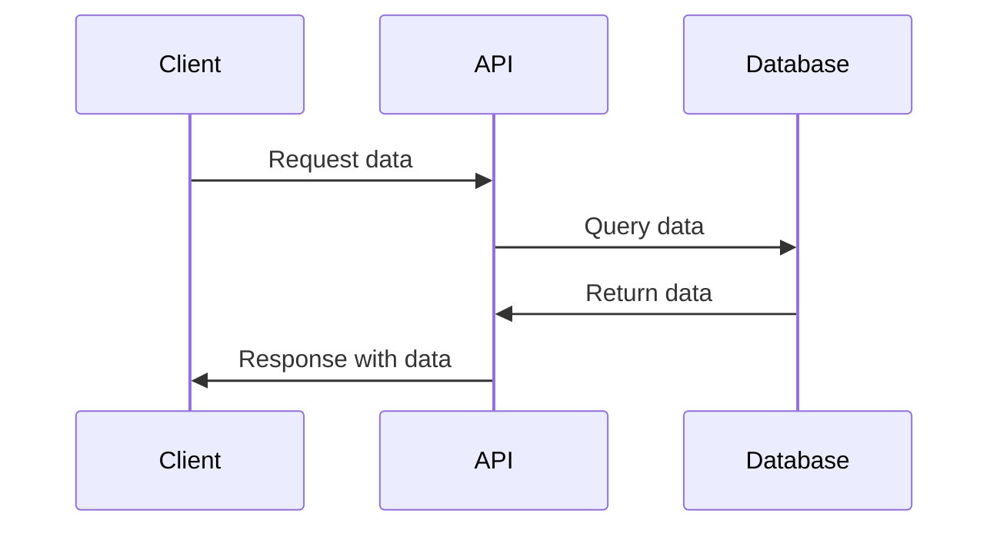

# Custom Documentation Guide for Kraven UI

This guide explains how to configure and add custom documentation to your Spring Boot application using the Kraven UI Library.

## Table of Contents

- [Overview](#overview)
- [Configuration](#configuration)
  - [Properties Configuration](#properties-configuration)
  - [YAML Configuration](#yaml-configuration)
- [Documentation Structure](#documentation-structure)
  - [Directory Structure](#directory-structure)
  - [Configuration File](#configuration-file)
- [Writing Documentation](#writing-documentation)
  - [Markdown Format](#markdown-format)
  - [File Naming Conventions](#file-naming-conventions)
  - [Headings and Titles](#headings-and-titles)
  - [Code Blocks](#code-blocks)
  - [Mermaid Diagrams](#mermaid-diagrams)
  - [Business Flow Tags](#business-flow-tags)
- [Advanced Features](#advanced-features)
  - [Syntax Highlighting](#syntax-highlighting)
  - [Auto-Refresh](#auto-refresh)
- [Examples](#examples)
  - [Basic Documentation File](#basic-documentation-file)
  - [Documentation with Mermaid Diagram](#documentation-with-mermaid-diagram)
  - [Documentation with Business Flow Tags](#documentation-with-business-flow-tags)

## Overview

Kraven UI provides a built-in documentation system that allows you to write and organize custom documentation for your service using Markdown files. This documentation is accessible through the Kraven UI interface and supports features like syntax highlighting, Mermaid diagrams, and business flow tags.

## Configuration

### Properties Configuration

Add the following configuration to your `application.properties` file:

```properties
# Documentation configuration
kraven.ui.documentation.enabled=true
kraven.ui.documentation.path=classpath:kraven-docs/
kraven.ui.documentation.mermaid-enabled=true
kraven.ui.documentation.syntax-highlighting-enabled=true
kraven.ui.documentation.business-flow-tags-enabled=true
kraven.ui.documentation.auto-refresh-enabled=false
kraven.ui.documentation.refresh-interval-ms=0
```

### YAML Configuration

Alternatively, you can use YAML configuration in your `application.yml` file:

```yaml
kraven:
  ui:
    documentation:
      enabled: true
      path: classpath:kraven-docs/
      mermaid-enabled: true
      syntax-highlighting-enabled: true
      business-flow-tags-enabled: true
      auto-refresh-enabled: false
      refresh-interval-ms: 0
```

## Documentation Structure

### Directory Structure

Create a directory structure for your documentation files. By default, Kraven UI looks for documentation files in the `classpath:kraven-docs/` directory. You can customize this path using the `kraven.ui.documentation.path` property.

Example directory structure:

```
src/main/resources/
└── kraven-docs/
    ├── doc-config.json
    ├── getting-started/
    │   ├── overview.md
    │   ├── installation.md
    │   └── configuration.md
    ├── api-guides/
    │   ├── authentication.md
    │   ├── pagination.md
    │   └── error-handling.md
    └── examples/
        ├── basic-usage.md
        └── advanced-scenarios.md
```

### Configuration File

Create a `doc-config.json` file in the root of your documentation directory to define the structure and organization of your documentation:

```json
{
  "title": "My Service Documentation",
  "description": "Comprehensive documentation for My Service",
  "version": "1.0.0",
  "groups": [
    {
      "id": "getting-started",
      "title": "Getting Started",
      "description": "Get started with My Service",
      "overviewPath": "getting-started/overview.md",
      "order": 1,
      "icon": "play_arrow",
      "include": ["getting-started/*.md"],
      "exclude": []
    },
    {
      "id": "api-guides",
      "title": "API Guides",
      "description": "Detailed guides for using the API",
      "order": 2,
      "icon": "description",
      "include": ["api-guides/*.md"],
      "exclude": []
    },
    {
      "id": "examples",
      "title": "Examples",
      "description": "Example usage scenarios",
      "order": 3,
      "icon": "code",
      "include": ["examples/*.md"],
      "exclude": []
    }
  ]
}
```

## Writing Documentation

### Markdown Format

Documentation files should be written in Markdown format with the `.md` or `.markdown` extension. Kraven UI supports standard Markdown syntax as well as additional features like syntax highlighting and Mermaid diagrams.

### File Naming Conventions

Use descriptive, kebab-case filenames for your documentation files. For example:

- `getting-started.md`
- `api-authentication.md`
- `error-handling-guide.md`

### Headings and Titles

The first heading in your Markdown file (using `# Title`) will be used as the title of the documentation page. If no heading is found, the filename will be converted to title case.

Example:

```markdown
# API Authentication Guide

This guide explains how to authenticate with the API.

## Authentication Methods

...
```

### Code Blocks

Use triple backticks (```) to create code blocks. You can specify the language for syntax highlighting:

```markdown
```java
public class Example {
    public static void main(String[] args) {
        System.out.println("Hello, World!");
    }
}
```
```

### Mermaid Diagrams

If Mermaid is enabled (`kraven.ui.documentation.mermaid-enabled=true`), you can include Mermaid diagrams in your documentation:

```markdown

```

### Business Flow Tags

If business flow tags are enabled (`kraven.ui.documentation.business-flow-tags-enabled=true`), you can include business flow tags in your documentation to link to specific methods in your codebase:

```markdown
This API follows this business flow:

<!-- @flow: UserRegistrationFlow -->
1. User submits registration form
2. System validates user input
3. System creates user account
4. System sends confirmation email
<!-- @end-flow -->
```

## Advanced Features

### Syntax Highlighting

Kraven UI supports syntax highlighting for code blocks. To enable syntax highlighting, set `kraven.ui.documentation.syntax-highlighting-enabled=true` in your configuration.

### Auto-Refresh

You can enable auto-refresh for documentation by setting `kraven.ui.documentation.auto-refresh-enabled=true` and specifying a refresh interval in milliseconds with `kraven.ui.documentation.refresh-interval-ms`.

## Examples

### Basic Documentation File

```markdown
# Getting Started

This guide will help you get started with our service.

## Prerequisites

- Java 17 or higher
- Maven 3.6 or higher
- Docker (optional)

## Installation

Add the following dependency to your `pom.xml`:

```xml
<dependency>
    <groupId>com.example</groupId>
    <artifactId>my-service-client</artifactId>
    <version>1.0.0</version>
</dependency>
```

## Basic Usage

```java
import com.example.MyServiceClient;

public class Example {
    public static void main(String[] args) {
        MyServiceClient client = new MyServiceClient("https://api.example.com");
        client.authenticate("username", "password");
        
        // Make API calls
        Response response = client.getData();
        System.out.println(response);
    }
}
```
```

### Documentation with Mermaid Diagram

See the [Mermaid Diagrams](#mermaid-diagrams) section for an example.

### Documentation with Business Flow Tags

See the [Business Flow Tags](#business-flow-tags) section for an example.
