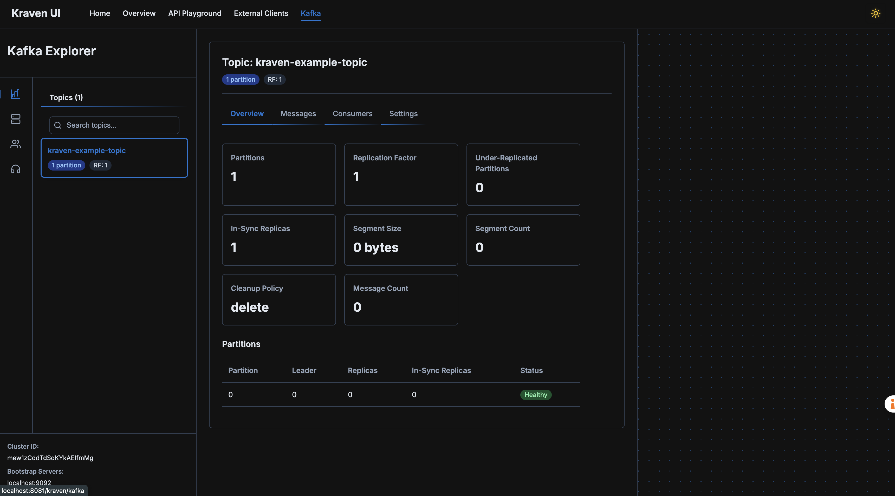

# 🔥 Kraven UI for Spring Boot

<p align="center">
  
</p>

> **⚡ ULTRA-LIGHTWEIGHT: Only 7,552 bytes (0.007 MB) heap footprint!** The entire core library uses less memory than a small JPEG image.

> *Because your APIs deserve better than being dressed in rags.*

A ridiculously good-looking, highly readable, and customizable documentation UI for OpenAPI specifications generated by springdoc-openapi. Kraven UI combines the elegant readability of Redoc with the interactive playground capabilities of Swagger UI, but with way more style and fewer existential crises.

More than just API documentation, Kraven UI is a **complete development and debugging toolkit** that brings together API testing, Feign client exploration, Kafka management, and application monitoring in one unified interface. It's designed to make your development workflow smoother, debugging less painful, and your life as a developer significantly better.

<p align="center">
  
</p>

## 🚀 Features That Will Make Your Development & Debugging Life Less Miserable

### 🎭 API Documentation That Doesn't Make Your Eyes Bleed
- 🌓 **Light/Dark Theme** - Because we respect your retinas at 2 AM
- 📱 **Responsive Layout** - Three layout options that actually work on all devices (shocking, we know)
- 🔍 **Markdown Support** - Write API descriptions that don't look like they're from 1997
- 🧪 **Interactive Try-It-Out** - Test your APIs without switching to Postman (revolutionary concept)
- 📦 **Sample Request Bodies** - Auto-generated examples so you don't have to guess the format
- 🔖 **Favorites System** - Bookmark your most-used endpoints for quick access
- 🔎 **Enhanced Search** - Find endpoints by path, description, or parameters with tag-based filtering
- 📑 **Dual-Mode Interface** - Switch between Documentation and Playground modes for different workflows

<p align="center">
  
</p>

### 🕵️ Feign Client Explorer
- 🔭 **Discover Feign Clients** - Automatically scans and displays all your Feign clients
- 🧩 **Interactive Testing** - Try out your Feign clients directly from the UI
- 🔍 **Client Search** - Find that one client among the hundreds you've created and forgotten about

<p align="center">
  
</p>

### 🐮 Kafka Management UI
- 📊 **Topic Overview** - See all your Kafka topics in one place (finally!)
- 📨 **Message Producer** - Send messages to topics without writing a single line of code
- 📬 **Message Browser** - View messages in topics with filtering and pagination
- 📡 **Live Streaming** - Watch messages arrive in real-time (it's like Netflix, but for data)
- 👥 **Consumer Groups** - Monitor consumer groups and their lag (before your system crashes)

<p align="center">
  
</p>

### 📚 Documentation Hub (Alpha)
- 📝 **Markdown Documentation** - Write beautiful documentation in Markdown format
- 📊 **Mermaid Diagrams** - Create interactive diagrams with Mermaid.js
- 🏷️ **Business Flow Tags** - Define business flows directly in your documentation
- 🔍 **Flow Visualization** - See how functionality flows through different layers of your application
- 🧩 **Organized Structure** - Group documentation into logical sections
- 🔄 **Documentation Refresh** - Update documentation on-demand as your application evolves

<p align="center">
  
</p>

### 📈 Application Monitoring
- 🧠 **JVM Metrics** - Memory usage, thread stats, garbage collection, and more nerdy details
- ⚙️ **Spring Metrics** - Bean count, endpoints, and other Spring-related metrics
- 🔍 **Detailed Memory Analysis** - Heap, non-heap, and memory pool breakdowns with usage visualization
- 📊 **Interactive Visualizations** - Pretty charts that make monitoring almost fun
- 🔄 **Auto-refresh** - Watch your application slowly die in real-time
- 📥 **Thread & Heap Dumps** - Generate and download thread dumps and heap dumps for debugging
- 📊 **Metrics Export** - Download metrics summaries in text and JSON formats

<p align="center">
  
</p>

## 🛠️ Why Kraven UI for Development & Debugging

### One Tool to Rule Them All
Tired of juggling between Swagger UI, Postman, Kafka UIs, and monitoring tools? Kraven UI consolidates everything into a **single, unified interface**. No more context switching between different tools - everything you need is in one place.

<p align="center">
  
</p>

### Supercharged Development Workflow
- **Instant API Testing**: Test your endpoints as you develop them, without leaving the browser
- **Feign Client Debugging**: Troubleshoot external service calls directly from the UI
- **Kafka Message Inspection**: Debug message flows without writing consumer code
- **Real-time Monitoring**: Watch your application metrics change as you test different features

### Debugging Made Actually Enjoyable
- **Thread Dumps on Demand**: Generate thread dumps with a single click when things go sideways
- **Heap Analysis**: Identify memory leaks and analyze memory usage patterns
- **Message Tracing**: Follow messages through your Kafka ecosystem
- **API Response Inspection**: Examine detailed responses with syntax highlighting

### Time-Saving Features for Developers
- **Auto-Generated Request Bodies**: No more guessing the correct JSON structure
- **Live Streaming**: Watch Kafka messages arrive in real-time as your system processes them
- **Export Options**: Export API definitions to Postman or as cURL commands
- **Targeted Postman Exports**: Export specific endpoint groups to Postman collections for focused testing
- **Favorites System**: Bookmark frequently used endpoints for quick access in future sessions
- **Tag-Based Search**: Find endpoints quickly using multiple search tags with context highlighting
- **Documentation Mode**: Learn about APIs without the distraction of execution panels
- **Context Menu**: Right-click on tabs for quick actions like closing, favoriting, or copying as cURL

### Simplicity Without Sacrifice
- **Zero Configuration**: Works out of the box with sensible defaults
- **Minimal Dependencies**: Lightweight integration that won't bloat your application
- **Incredibly Memory Efficient**: Core library uses only 7,552 bytes (0.007 MB) of heap memory
- **Intuitive UI**: Clean, modern interface that doesn't require a manual to understand
- **Customizable**: Easily configure to match your specific needs

### Perfect for Local Development
- **Instant Feedback**: See the effects of your code changes immediately
- **Reduced Context Switching**: Stay in your development flow without jumping between tools
- **Team Collaboration**: Share a common interface for API exploration and debugging
- **Environment Consistency**: Same experience across all environments, from local to production

## 🧩 Project Structure

This is a multi-module Maven project with the following modules:

- **kraven-ui-core**: Core functionality (where the magic happens)
- **kraven-ui-frontend**: Frontend Angular application (the pretty face)
- **kraven-ui-spring-boot-starter**: Spring Boot starter (for the lazy developers among us)
- **kraven-ui-plugin-sdk**: Plugin SDK for developing custom plugins (extensibility FTW)
- **plugins/kraven-ui-kafka-plugin**: Kafka management plugin (because Kafka deserves special treatment)
- **kraven-ui-example**: Example application (for when the docs inevitably fail you)

## 🚨 Compatibility Notes

When integrating Kraven UI into your projects, be aware of these potential compatibility issues:

- **Caching**: Kraven UI uses its own internal caching mechanism that doesn't depend on Spring's caching infrastructure, avoiding conflicts with your application's cache configuration. You can control caching with the `kraven.ui.cache.enabled` property. The library is designed to work even if the cache service bean cannot be autowired.
- **OpenTelemetry**: Some versions of OpenTelemetry may cause stack overflow errors when used with Kraven UI. Consider excluding OpenTelemetry dependencies if you encounter issues.

## 🔌 Plugin System

Kraven UI features a powerful plugin-based architecture that allows for easy extension and customization:

- **Plugin SDK**: Develop your own plugins using the `kraven-ui-plugin-sdk` module
- **Dynamic Registration**: Plugins register with the core at runtime
- **UI Integration**: Plugins automatically appear in the UI when registered and running
- **Independent Lifecycle**: Start, stop, and manage plugins independently
- **Configurable**: Each plugin has its own configuration options

### Available Plugins

Kraven UI comes with the following plugins:

| Plugin | Description | Features | Documentation |
|--------|-------------|----------|--------------|
| **Kafka** | Comprehensive Kafka management | Topic management, message production/consumption, streaming, consumer groups, listener discovery | [Kafka Plugin README](plugins/kraven-ui-kafka-plugin/README.md) |
| **Mock Server** | Integration testing & development tool | Mock API responses for testing and development, request validation, scenario management | [Mock Server Plugin README](plugins/kraven-ui-mock-server-plugin/README.md) |
| **Database Explorer** | Database management | Table browsing, query execution, schema visualization | Coming soon |
| **GraphQL** | GraphQL support | Schema exploration, query builder, mutation testing | Coming soon |

## 🏗️ Development Status

This project is actively maintained by developers who care way too much about UI/UX:

- ✅ **API Documentation** - Fully functional with all the bells and whistles
- ✅ **Feign Client Explorer** - Complete and ready to make your life easier
- ✅ **Kafka Management** - Fully operational and waiting for your Kafka clusters
- ✅ **Application Monitoring** - Ready to show you all the metrics you never knew you needed
- ✅ **Plugin System** - Fully functional with support for custom plugins
- 🔄 **Documentation Hub** - Alpha feature for creating beautiful documentation with Mermaid diagrams and business flow tags

## 🚦 Getting Started in 3... 2... 1... (Your Development Environment Will Thank You)

### 🛠️ Building from Source (For the Brave)

To build the project from source (and potentially question your life choices):

```bash
mvn clean install # Prepare for a coffee break
```

### 🔌 Integrating with Your Maven Application (The Easy Way)

#### 1. Add the Kraven UI Starter Dependency

Add the following dependency to your Spring Boot application's `pom.xml` (copy-paste, we won't judge):

```xml
<dependency>
    <groupId>io.github.rohitect</groupId>
    <artifactId>kraven-ui</artifactId>
    <version>1.0.4</version>
</dependency>
```

#### 2. Ensure SpringDoc OpenAPI is Configured

Make sure you have SpringDoc OpenAPI configured (because Kraven UI needs something to make pretty):

```xml
<dependency>
    <groupId>org.springdoc</groupId>
    <artifactId>springdoc-openapi-starter-webmvc-ui</artifactId>
    <version>2.3.0</version>
</dependency>
```

#### 3. Configure Kraven UI (Optional, but Recommended)

Add configuration to your `application.properties` or `application.yml` file (customize to your heart's content):

```properties
# Kraven UI Configuration
kraven.ui.path=/kraven
kraven.ui.layout.type=three-pane
kraven.ui.cache.enabled=true  # Set to false if you have Redis or other cache manager conflicts

# SpringDoc OpenAPI Configuration
springdoc.api-docs.path=/v3/api-docs
springdoc.swagger-ui.enabled=false  # Ditch Swagger UI, you've upgraded
```

#### 4. Run Your Application

Start your Spring Boot application and navigate to the configured path (e.g., `http://localhost:8080/kraven`). Prepare to be amazed... or at least mildly impressed.

## ⚙️ Configuration Options (For Control Freaks)

Kraven UI offers a powerful configuration system that supports both application properties and environment variables with JSON format. Here's a quick overview:

### Application Properties/YAML

```properties
# Basic configuration
kraven.ui.enabled=true
kraven.ui.path=/kraven

# Layout configuration
kraven.ui.layout.type=three-pane
kraven.ui.layout.middle-pane-width=600
kraven.ui.layout.right-pane-width=400

# Theme configuration
kraven.ui.theme.dark-primary-color=#1976d2
kraven.ui.theme.dark-secondary-color=#424242
kraven.ui.theme.dark-background-color=#121212
kraven.ui.theme.light-primary-color=#1976d2
kraven.ui.theme.light-secondary-color=#424242
kraven.ui.theme.light-background-color=#ffffff
kraven.ui.theme.default-theme=dark

# Feign Client Explorer configuration
kraven.ui.feign-client.enabled=true
kraven.ui.feign-client.api-path=/kraven/v1/feign-clients
kraven.ui.feign-client.try-it-out-enabled=true

# Plugin system configuration
kraven.ui.plugins.enabled=true
kraven.ui.plugins.auto-discovery=true
kraven.ui.plugins.base-packages=com.example

# Metrics configuration
kraven.ui.metrics.enabled=true
kraven.ui.metrics.api-path=/api/kraven-metrics
kraven.ui.metrics.jvm-metrics-enabled=true
kraven.ui.metrics.spring-metrics-enabled=true
kraven.ui.metrics.kafka-metrics-enabled=true
kraven.ui.metrics.feign-metrics-enabled=true
kraven.ui.metrics.refresh-interval-ms=5000
kraven.ui.metrics.auto-refresh-enabled=false
kraven.ui.metrics.thread-dump-enabled=true
kraven.ui.metrics.heap-dump-enabled=false
```

### Environment Variables

You can also configure Kraven UI using the `KRAVEN_UI_CONFIG` environment variable with a JSON string:

```bash
export KRAVEN_UI_CONFIG='{"path":"/api-docs","theme":{"darkPrimaryColor":"#ff5722","darkSecondaryColor":"#607d8b","darkBackgroundColor":"#121212","lightPrimaryColor":"#2196f3","lightSecondaryColor":"#ff9800","lightBackgroundColor":"#ffffff","defaultTheme":"dark"},"kafka":{"messageLimit":200},"metrics":{"refreshIntervalMs":10000,"autoRefreshEnabled":true,"threadDumpEnabled":true,"heapDumpEnabled":false}}'
```

For a complete list of all configuration options, see the [Configuration Guide](CONFIGURATION.md).

## 🎮 Feature Showcase: What Makes Kraven UI Special

### 🎭 API Documentation

The API Documentation UI is where Kraven UI really shines:

- **Dual-Mode Interface**: Switch between Documentation mode (for learning) and Playground mode (for testing)
- **Three-Pane Layout**: Left navigation, middle details, right try-it-out panel
- **Markdown Support**: Write API descriptions with proper formatting, code blocks, and links
- **Interactive Try-It-Out**: Test your APIs directly from the documentation
- **Schema Visualization**: Clear, collapsible schema representations
- **Response Samples**: Auto-generated response examples
- **Export Options**: Export API definitions to Postman and other formats
- **Endpoint Group Export**: Export specific endpoint groups to Postman with a single click
- **Postman Integration**: Generate ready-to-use Postman collections with headers and example request bodies
- **Favorites System**: Bookmark frequently used endpoints for quick access across sessions
- **Tag-Based Search**: Find endpoints using multiple search tags with context highlighting
- **Request History**: Track your API call history for easy reference and reuse
- **Context Menu**: Right-click on tabs for quick actions like closing, favoriting, or copying as cURL

### 🕵️ Feign Client Explorer

Discover and interact with your application's Feign clients:

- **Auto-Discovery**: Automatically finds all Feign clients in your application
- **Method Exploration**: View and test all methods on each client
- **Parameter Testing**: Try out different parameter values
- **Response Visualization**: See the actual responses from your external services

### 🐮 Kafka Management

Manage your Kafka clusters with ease through the [Kafka Plugin](plugins/kraven-ui-kafka-plugin/README.md). See the plugin documentation for detailed features and configuration options.

### 📈 Application Monitoring

Get insights into your application's performance:

- **JVM Metrics**: Memory usage, garbage collection, threads, class loading
- **Memory Pools**: Detailed breakdown of memory usage by pool with visual progress bars
- **Thread Information**: Active threads, daemon threads, and thread dumps
- **Spring Metrics**: Bean count, controllers, services, repositories, and endpoint details
- **Kafka Metrics**: Topic count, consumer groups, producers, and listeners (requires Kafka plugin)
- **Feign Client Metrics**: Client count and method count
- **Auto-Refresh**: Configurable auto-refresh intervals with visual progress indicator
- **Thread & Heap Dumps**: Generate and download thread dumps and heap dumps for debugging
- **Data Export**: Download metrics summaries in text and JSON formats
- **Customizable**: Configure which metrics to collect and display

### 📚 Documentation Hub

Create and organize beautiful documentation for your service:

- **Markdown Support**: Write documentation in Markdown format with full formatting capabilities
- **Mermaid Diagrams**: Create interactive diagrams using Mermaid.js syntax
- **Business Flow Tags**: Define business flows directly in your documentation using a custom DSL
- **Flow Visualization**: See how functionality flows through different layers of your application
- **Documentation Organization**: Group documentation into logical sections with a configurable structure
- **Search Functionality**: Find specific documentation quickly with full-text search
- **Refresh On Demand**: Update documentation as your application evolves
- **Syntax Highlighting**: Beautiful code highlighting for code blocks
- **Customizable**: Configure documentation path, features, and appearance

## 📋 Example: Supercharge Your Spring Boot Development with Kraven UI

Here's a complete example of how to set up a Spring Boot REST API with Kraven UI to create the ultimate development environment (because we know you'll just copy-paste this anyway):

### 1. Create a Spring Boot Application

```xml
<!-- pom.xml -->
<project>
    <groupId>com.example</groupId>
    <artifactId>demo-api</artifactId>
    <version>0.0.1-SNAPSHOT</version>

    <parent>
        <groupId>org.springframework.boot</groupId>
        <artifactId>spring-boot-starter-parent</artifactId>
        <version>3.2.0</version>
    </parent>

    <dependencies>
        <!-- Spring Boot Web -->
        <dependency>
            <groupId>org.springframework.boot</groupId>
            <artifactId>spring-boot-starter-web</artifactId>
        </dependency>

        <!-- SpringDoc OpenAPI -->
        <dependency>
            <groupId>org.springdoc</groupId>
            <artifactId>springdoc-openapi-starter-webmvc-ui</artifactId>
            <version>2.3.0</version>
        </dependency>

        <!-- Kraven UI -->
        <dependency>
            <groupId>io.github.rohitect</groupId>
            <artifactId>kraven-ui</artifactId>
            <version>1.1.0</version>
        </dependency>
    </dependencies>
</project>
```

### 2. Configure OpenAPI Information

```java
// OpenApiConfig.java
package com.example.config;

import io.swagger.v3.oas.models.OpenAPI;
import io.swagger.v3.oas.models.info.Info;
import io.swagger.v3.oas.models.info.Contact;
import io.swagger.v3.oas.models.info.License;
import io.swagger.v3.oas.models.servers.Server;
import org.springframework.context.annotation.Bean;
import org.springframework.context.annotation.Configuration;

import java.util.List;

@Configuration
public class OpenApiConfig {

    @Bean
    public OpenAPI customOpenAPI() {
        return new OpenAPI()
            .info(new Info()
                .title("Example API")
                .version("1.0.0")
                .description("This is a sample Spring Boot RESTful service using Kraven UI")
                .contact(new Contact()
                    .name("API Support")
                    .email("support@example.com")
                    .url("https://example.com/support"))
                .license(new License()
                    .name("Apache 2.0")
                    .url("https://www.apache.org/licenses/LICENSE-2.0.html")))
            .servers(List.of(
                new Server()
                    .url("/")
                    .description("Local server")));
    }
}
```

### 3. Configure Application Properties

```properties
# application.properties

# Server configuration
server.port=8080

# SpringDoc OpenAPI configuration
springdoc.api-docs.path=/v3/api-docs
springdoc.swagger-ui.enabled=false

# Kraven UI configuration
kraven.ui.enabled=true
kraven.ui.path=/kraven
kraven.ui.layout.type=three-pane

# Theme configuration
kraven.ui.theme.dark-primary-color=#1976d2
kraven.ui.theme.dark-secondary-color=#424242
kraven.ui.theme.dark-background-color=#121212
kraven.ui.theme.light-primary-color=#1976d2
kraven.ui.theme.light-secondary-color=#424242
kraven.ui.theme.light-background-color=#ffffff
kraven.ui.theme.default-theme=dark

# Feature configurations
kraven.ui.feign-client.enabled=true
kraven.ui.kafka.enabled=true
kraven.ui.business-flow.enabled=true

# Metrics configuration
kraven.ui.metrics.enabled=true
kraven.ui.metrics.jvm-metrics-enabled=true
kraven.ui.metrics.spring-metrics-enabled=true
kraven.ui.metrics.kafka-metrics-enabled=true
kraven.ui.metrics.feign-metrics-enabled=true
kraven.ui.metrics.refresh-interval-ms=5000
kraven.ui.metrics.auto-refresh-enabled=false
kraven.ui.metrics.thread-dump-enabled=true
kraven.ui.metrics.heap-dump-enabled=false

# Cache configuration
kraven.ui.cache.enabled=true

# Documentation configuration
kraven.ui.documentation.enabled=true
kraven.ui.documentation.path=classpath:kraven-docs/
kraven.ui.documentation.mermaid-enabled=true
kraven.ui.documentation.syntax-highlighting-enabled=true
kraven.ui.documentation.business-flow-tags-enabled=true
```

### 4. Run the Application

Start your Spring Boot application and navigate to `http://localhost:8080/kraven` to see your API documentation with Kraven UI.

**Congratulations!** You've just transformed your development environment into a productivity powerhouse. Now you can:

- Test your APIs directly from the documentation
- Debug Feign client calls to external services
- Monitor your Kafka topics and messages (with the Kafka plugin)
- Track your application's performance metrics
- Generate thread dumps when things go wrong
- All from a single, beautiful interface that doesn't make your eyes bleed

Your development workflow will never be the same again!

## 🔮 Future Plans

We're not done yet! Here's what's coming in future releases:

- 📝 **Live API Logs** - Watch API calls in real-time
- 📊 **GraphQL Support** - Because REST isn't the only game in town
- 🔄 **API Workflows** - Chain API calls together
- 🗄️ **Database UIs** - Redis, MySQL repository explorers
- 🔐 **RBAC** - Role-based access control
- 📚 **Versioned Documentation** - Support for API versioning

## � Screenshot Gallery

<details>
<summary>Click to expand and see all screenshots</summary>

### Home Page
<p align="center">
  
</p>

### API Playground
<p align="center">
  
</p>

### Feign Client Explorer
<p align="center">
  
</p>

### Kafka Explorer
<p align="center">
  
</p>

### Application Overview
<p align="center">
  
</p>

</details>

## �📜 License

MIT (We're generous like that)
