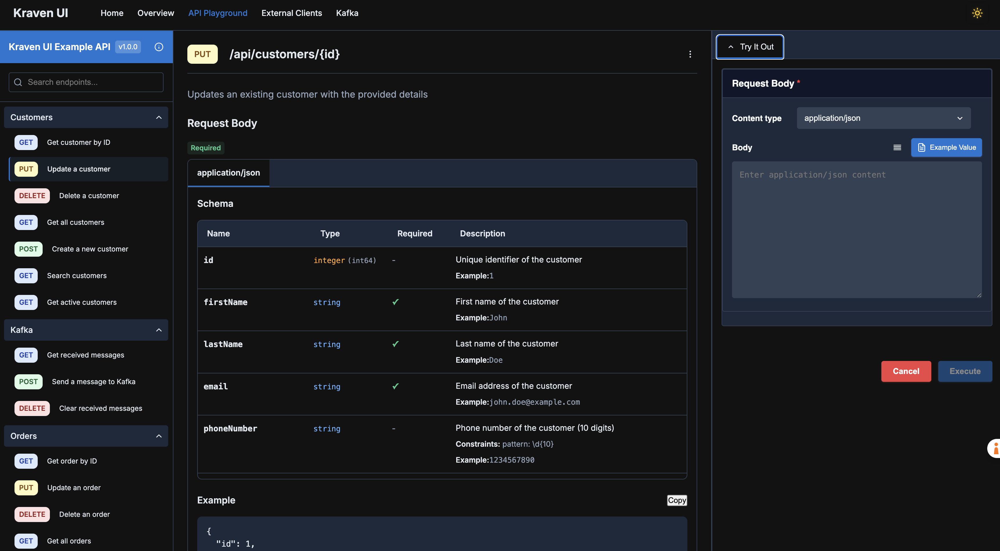

# 🔥 Kraven UI for Spring Boot

<p align="center">
  
</p>

> *Because your APIs deserve better than being dressed in rags.*

A ridiculously good-looking, highly readable, and customizable documentation UI for OpenAPI specifications generated by springdoc-openapi. Kraven UI combines the elegant readability of Redoc with the interactive playground capabilities of Swagger UI, but with way more style and fewer existential crises.

<p align="center">
  
</p>

## 🚀 Features That Will Make Your Developer Life Less Miserable

### 🎭 API Documentation That Doesn't Make Your Eyes Bleed
- 🌓 **Light/Dark Theme** - Because we respect your retinas at 2 AM
- 📱 **Responsive Layout** - Three layout options that actually work on all devices (shocking, we know)
- 🔍 **Markdown Support** - Write API descriptions that don't look like they're from 1997
- 🧪 **Interactive Try-It-Out** - Test your APIs without switching to Postman (revolutionary concept)
- 🔐 **Global Authentication** - Support for Basic, Bearer, and API Key auth (because security matters... sometimes)
- 📦 **Sample Request Bodies** - Auto-generated examples so you don't have to guess the format

<p align="center">
  
</p>

### 🕵️ Feign Client Explorer
- 🔭 **Discover Feign Clients** - Automatically scans and displays all your Feign clients
- 🧩 **Interactive Testing** - Try out your Feign clients directly from the UI
- 🔍 **Client Search** - Find that one client among the hundreds you've created and forgotten about

<p align="center">
  
</p>

### 🐮 Kafka Management UI
- 📊 **Topic Overview** - See all your Kafka topics in one place (finally!)
- 📨 **Message Producer** - Send messages to topics without writing a single line of code
- 📬 **Message Browser** - View messages in topics with filtering and pagination
- 📡 **Live Streaming** - Watch messages arrive in real-time (it's like Netflix, but for data)
- 👥 **Consumer Groups** - Monitor consumer groups and their lag (before your system crashes)

<p align="center">
  
</p>

### 📈 Application Monitoring
- 🧠 **JVM Metrics** - Memory usage, thread stats, garbage collection, and more nerdy details
- ⚙️ **Spring Metrics** - Bean count, endpoints, and other Spring-related metrics
- 🔍 **Detailed Memory Analysis** - Heap, non-heap, and memory pool breakdowns with usage visualization
- 📊 **Interactive Visualizations** - Pretty charts that make monitoring almost fun
- 🔄 **Auto-refresh** - Watch your application slowly die in real-time
- 📥 **Thread & Heap Dumps** - Generate and download thread dumps and heap dumps for debugging
- 📊 **Metrics Export** - Download metrics summaries in text and JSON formats

<p align="center">
  
</p>

## 🧩 Project Structure

This is a multi-module Maven project with the following modules:

- **kraven-ui-core**: Core functionality (where the magic happens)
- **kraven-ui-frontend**: Frontend Angular application (the pretty face)
- **kraven-ui-spring-boot-starter**: Spring Boot starter (for the lazy developers among us)
- **kraven-ui-example**: Example application (for when the docs inevitably fail you)

## 🏗️ Development Status

This project is actively maintained by developers who care way too much about UI/UX:

- ✅ **API Documentation** - Fully functional with all the bells and whistles
- ✅ **Feign Client Explorer** - Complete and ready to make your life easier
- ✅ **Kafka Management** - Fully operational and waiting for your Kafka clusters
- ✅ **Application Monitoring** - Ready to show you all the metrics you never knew you needed

## 🚦 Getting Started in 3... 2... 1...

### 🛠️ Building from Source (For the Brave)

To build the project from source (and potentially question your life choices):

```bash
mvn clean install # Prepare for a coffee break
```

### 🔌 Integrating with Your Maven Application (The Easy Way)

#### 1. Add the Kraven UI Starter Dependency

Add the following dependency to your Spring Boot application's `pom.xml` (copy-paste, we won't judge):

```xml
<dependency>
    <groupId>io.github.rohitect</groupId>
    <artifactId>kraven-ui-spring-boot-starter</artifactId>
    <version>1.0.1</version>
</dependency>
```

#### 2. Ensure SpringDoc OpenAPI is Configured

Make sure you have SpringDoc OpenAPI configured (because Kraven UI needs something to make pretty):

```xml
<dependency>
    <groupId>org.springdoc</groupId>
    <artifactId>springdoc-openapi-starter-webmvc-ui</artifactId>
    <version>2.3.0</version>
</dependency>
```

#### 3. Configure Kraven UI (Optional, but Recommended)

Add configuration to your `application.properties` or `application.yml` file (customize to your heart's content):

```properties
# Kraven UI Configuration
kraven.ui.path=/kraven
kraven.ui.layout.type=three-pane

# SpringDoc OpenAPI Configuration
springdoc.api-docs.path=/v3/api-docs
springdoc.swagger-ui.enabled=false  # Ditch Swagger UI, you've upgraded
```

#### 4. Configure Spring Security (If You're Using It)

If your application uses Spring Security, you'll need to allow access to the Kraven UI path. Add the following configuration:

```java
@Configuration
@EnableWebSecurity
public class SecurityConfig {

    @Bean
    public SecurityFilterChain securityFilterChain(HttpSecurity http) throws Exception {
        return http
            .authorizeHttpRequests(authorize -> authorize
                // Allow access to Kraven UI paths
                .requestMatchers("/kraven/**", "/kraven").permitAll()
                // Or use the configured path from properties
                // .requestMatchers(antMatcher(kravenUiProperties.getPath() + "/**")).permitAll()

                // Your other security rules...
                // .anyRequest().authenticated()
            )
            // Other security configuration...
            .build();
    }
}
```

For Spring Boot 2.x with older Spring Security versions:

```java
@Configuration
@EnableWebSecurity
public class SecurityConfig extends WebSecurityConfigurerAdapter {

    @Override
    protected void configure(HttpSecurity http) throws Exception {
        http
            .authorizeRequests()
                // Allow access to Kraven UI paths
                .antMatchers("/kraven/**", "/kraven").permitAll()
                // Your other security rules...
                // .anyRequest().authenticated()
                ;

        // Other security configuration...
    }
}
```

#### 5. Run Your Application

Start your Spring Boot application and navigate to the configured path (e.g., `http://localhost:8080/kraven`). Prepare to be amazed... or at least mildly impressed.

## ⚙️ Configuration Options (For Control Freaks)

Kraven UI offers a powerful configuration system that supports both application properties and environment variables with JSON format. Here's a quick overview:

### Application Properties/YAML

```properties
# Basic configuration
kraven.ui.enabled=true
kraven.ui.path=/kraven

# Layout configuration
kraven.ui.layout.type=three-pane
kraven.ui.layout.middle-pane-width=600
kraven.ui.layout.right-pane-width=400

# Theme configuration
kraven.ui.theme.dark-primary-color=#1976d2
kraven.ui.theme.dark-secondary-color=#424242
kraven.ui.theme.dark-background-color=#121212
kraven.ui.theme.light-primary-color=#1976d2
kraven.ui.theme.light-secondary-color=#424242
kraven.ui.theme.light-background-color=#ffffff
kraven.ui.theme.default-theme=dark

# Feign Client Explorer configuration
kraven.ui.feign-client.enabled=true
kraven.ui.feign-client.api-path=/kraven/v1/feign-clients
kraven.ui.feign-client.try-it-out-enabled=true

# Kafka Management configuration
kraven.ui.kafka.enabled=true
kraven.ui.kafka.message-limit=100
kraven.ui.kafka.streaming-enabled=true
kraven.ui.kafka.message-production-enabled=true
kraven.ui.kafka.message-consumption-enabled=true

# Metrics configuration
kraven.ui.metrics.enabled=true
kraven.ui.metrics.api-path=/api/kraven-metrics
kraven.ui.metrics.jvm-metrics-enabled=true
kraven.ui.metrics.spring-metrics-enabled=true
kraven.ui.metrics.kafka-metrics-enabled=true
kraven.ui.metrics.feign-metrics-enabled=true
kraven.ui.metrics.refresh-interval-ms=5000
kraven.ui.metrics.auto-refresh-enabled=false
kraven.ui.metrics.thread-dump-enabled=true
kraven.ui.metrics.heap-dump-enabled=false
```

### Environment Variables

You can also configure Kraven UI using the `KRAVEN_UI_CONFIG` environment variable with a JSON string:

```bash
export KRAVEN_UI_CONFIG='{"path":"/api-docs","theme":{"darkPrimaryColor":"#ff5722","darkSecondaryColor":"#607d8b","darkBackgroundColor":"#121212","lightPrimaryColor":"#2196f3","lightSecondaryColor":"#ff9800","lightBackgroundColor":"#ffffff","defaultTheme":"dark"},"kafka":{"messageLimit":200},"metrics":{"refreshIntervalMs":10000,"autoRefreshEnabled":true,"threadDumpEnabled":true,"heapDumpEnabled":false}}'
```

For a complete list of all configuration options, see the [Configuration Guide](CONFIGURATION.md).

## 🎮 Feature Showcase: What Makes Kraven UI Special

### 🎭 API Documentation

The API Documentation UI is where Kraven UI really shines:

- **Three-Pane Layout**: Left navigation, middle details, right try-it-out panel
- **Markdown Support**: Write API descriptions with proper formatting, code blocks, and links
- **Interactive Try-It-Out**: Test your APIs directly from the documentation
- **Authentication**: Global authentication settings for all API calls
- **Schema Visualization**: Clear, collapsible schema representations
- **Response Samples**: Auto-generated response examples
- **Export Options**: Export API definitions to Postman and other formats

### 🕵️ Feign Client Explorer

Discover and interact with your application's Feign clients:

- **Auto-Discovery**: Automatically finds all Feign clients in your application
- **Method Exploration**: View and test all methods on each client
- **Parameter Testing**: Try out different parameter values
- **Response Visualization**: See the actual responses from your external services

### 🐮 Kafka Management

Manage your Kafka clusters with ease:

- **Topic Browser**: View all topics and their configurations
- **Message Producer**: Send messages to topics with a simple UI
- **Message Consumer**: View messages in topics with filtering and pagination
- **Live Streaming**: Watch messages arrive in real-time
- **Consumer Group Monitoring**: Track consumer groups and their lag
- **Partition Details**: View detailed partition information

### 📈 Application Monitoring

Get insights into your application's performance:

- **JVM Metrics**: Memory usage, garbage collection, threads, class loading
- **Memory Pools**: Detailed breakdown of memory usage by pool with visual progress bars
- **Thread Information**: Active threads, daemon threads, and thread dumps
- **Spring Metrics**: Bean count, controllers, services, repositories, and endpoint details
- **Kafka Metrics**: Topic count, consumer groups, producers, and listeners
- **Feign Client Metrics**: Client count and method count
- **Auto-Refresh**: Configurable auto-refresh intervals with visual progress indicator
- **Thread & Heap Dumps**: Generate and download thread dumps and heap dumps for debugging
- **Data Export**: Download metrics summaries in text and JSON formats
- **Customizable**: Configure which metrics to collect and display

## 📋 Example: Using Kraven UI in a Spring Boot REST API

Here's a complete example of how to set up a Spring Boot REST API with Kraven UI (because we know you'll just copy-paste this anyway):

### 1. Create a Spring Boot Application

```xml
<!-- pom.xml -->
<project>
    <groupId>com.example</groupId>
    <artifactId>demo-api</artifactId>
    <version>0.0.1-SNAPSHOT</version>

    <parent>
        <groupId>org.springframework.boot</groupId>
        <artifactId>spring-boot-starter-parent</artifactId>
        <version>3.2.0</version>
    </parent>

    <dependencies>
        <!-- Spring Boot Web -->
        <dependency>
            <groupId>org.springframework.boot</groupId>
            <artifactId>spring-boot-starter-web</artifactId>
        </dependency>

        <!-- SpringDoc OpenAPI -->
        <dependency>
            <groupId>org.springdoc</groupId>
            <artifactId>springdoc-openapi-starter-webmvc-ui</artifactId>
            <version>2.3.0</version>
        </dependency>

        <!-- Kraven UI -->
        <dependency>
            <groupId>io.github.rohitect</groupId>
            <artifactId>kraven-ui-spring-boot-starter</artifactId>
            <version>1.0.1</version>
        </dependency>
    </dependencies>
</project>
```

### 2. Configure OpenAPI Information

```java
// OpenApiConfig.java
package com.example.config;

import io.swagger.v3.oas.models.OpenAPI;
import io.swagger.v3.oas.models.info.Info;
import io.swagger.v3.oas.models.info.Contact;
import io.swagger.v3.oas.models.info.License;
import io.swagger.v3.oas.models.servers.Server;
import org.springframework.context.annotation.Bean;
import org.springframework.context.annotation.Configuration;

import java.util.List;

@Configuration
public class OpenApiConfig {

    @Bean
    public OpenAPI customOpenAPI() {
        return new OpenAPI()
            .info(new Info()
                .title("Example API")
                .version("1.0.0")
                .description("This is a sample Spring Boot RESTful service using Kraven UI")
                .contact(new Contact()
                    .name("API Support")
                    .email("support@example.com")
                    .url("https://example.com/support"))
                .license(new License()
                    .name("Apache 2.0")
                    .url("https://www.apache.org/licenses/LICENSE-2.0.html")))
            .servers(List.of(
                new Server()
                    .url("/")
                    .description("Local server")));
    }
}
```

### 3. Configure Application Properties

```properties
# application.properties

# Server configuration
server.port=8080

# SpringDoc OpenAPI configuration
springdoc.api-docs.path=/v3/api-docs
springdoc.swagger-ui.enabled=false

# Kraven UI configuration
kraven.ui.enabled=true
kraven.ui.path=/kraven
kraven.ui.layout.type=three-pane

# Theme configuration
kraven.ui.theme.dark-primary-color=#1976d2
kraven.ui.theme.dark-secondary-color=#424242
kraven.ui.theme.dark-background-color=#121212
kraven.ui.theme.light-primary-color=#1976d2
kraven.ui.theme.light-secondary-color=#424242
kraven.ui.theme.light-background-color=#ffffff
kraven.ui.theme.default-theme=dark

# Feature configurations
kraven.ui.feign-client.enabled=true
kraven.ui.kafka.enabled=true

# Metrics configuration
kraven.ui.metrics.enabled=true
kraven.ui.metrics.jvm-metrics-enabled=true
kraven.ui.metrics.spring-metrics-enabled=true
kraven.ui.metrics.kafka-metrics-enabled=true
kraven.ui.metrics.feign-metrics-enabled=true
kraven.ui.metrics.refresh-interval-ms=5000
kraven.ui.metrics.auto-refresh-enabled=false
kraven.ui.metrics.thread-dump-enabled=true
kraven.ui.metrics.heap-dump-enabled=false
```

### 4. Configure Spring Security (If Applicable)

If your application uses Spring Security, add this configuration to allow access to Kraven UI:

```java
// SecurityConfig.java
package com.example.config;

import org.springframework.context.annotation.Bean;
import org.springframework.context.annotation.Configuration;
import org.springframework.security.config.annotation.web.builders.HttpSecurity;
import org.springframework.security.config.annotation.web.configuration.EnableWebSecurity;
import org.springframework.security.web.SecurityFilterChain;

@Configuration
@EnableWebSecurity
public class SecurityConfig {

    @Bean
    public SecurityFilterChain securityFilterChain(HttpSecurity http) throws Exception {
        return http
            .authorizeHttpRequests(authorize -> authorize
                // Allow access to API docs endpoint
                .requestMatchers("/v3/api-docs/**").permitAll()
                // Allow access to Kraven UI
                .requestMatchers("/kraven/**", "/kraven").permitAll()
                // Secure other endpoints as needed
                .anyRequest().authenticated()
            )
            // Disable CSRF for API endpoints if needed
            .csrf(csrf -> csrf.ignoringRequestMatchers("/api/**"))
            .build();
    }
}
```

### 5. Run the Application

Start your Spring Boot application and navigate to `http://localhost:8080/kraven` to see your API documentation with Kraven UI. Prepare to be amazed by how much better your APIs look now!

## 🔮 Future Plans

We're not done yet! Here's what's coming in future releases:

- 📝 **Live API Logs** - Watch API calls in real-time
- 📊 **GraphQL Support** - Because REST isn't the only game in town
- 🧪 **Mock Server Integration** - Test without real backends
- 🔄 **API Workflows** - Chain API calls together
- 🗄️ **Database UIs** - Redis, MySQL repository explorers
- 🔐 **RBAC** - Role-based access control
- 📚 **Versioned Documentation** - Support for API versioning

## � Screenshot Gallery

<details>
<summary>Click to expand and see all screenshots</summary>

### Home Page
<p align="center">
  
</p>

### API Playground
<p align="center">
  
</p>

### Feign Client Explorer
<p align="center">
  
</p>

### Kafka Explorer
<p align="center">
  
</p>

### Application Overview
<p align="center">
  
</p>

</details>

## �📜 License

MIT (We're generous like that)
