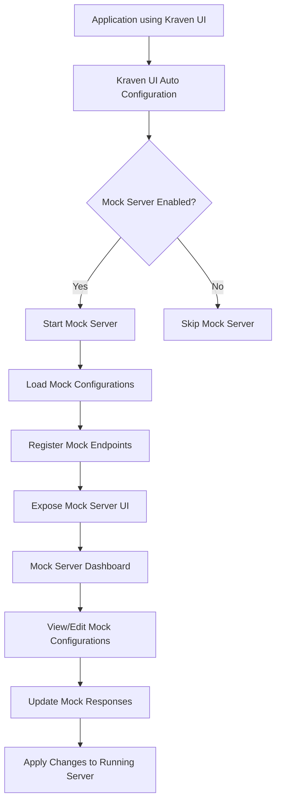

# Mock Server Integration Plan for Kraven UI

## Overview

This document outlines the plan for integrating a mock server feature into the Kraven UI library. The mock server will facilitate integration testing by providing a configurable way to mock API endpoints. This feature will enhance developer experience by allowing them to test their applications against mock responses without relying on actual backend services.

## Goals

1. Provide a configurable mock server that can be started by the Kraven UI library
2. Allow developers to define mock responses for specific endpoints via JSON configuration
3. Enable runtime switching between different mock responses for the same endpoint
4. Integrate seamlessly with the existing Kraven UI interface
5. Support various HTTP methods and response types
6. Enhance developer experience with intuitive UI and configuration options

## Architecture

### Components

1. **Mock Server Module**
   - Core server implementation based on Undertow
   - Configuration loader for mock definitions
   - Response selector and router
   - Metrics collector for mock server usage

2. **Configuration Model**
   - JSON schema for defining mock endpoints and responses
   - Support for multiple response variations per endpoint
   - Metadata for each response (description, tags, etc.)

3. **UI Components**
   - Mock Server dashboard in Kraven UI header navigation
   - Endpoint listing and response selection interface
   - Interactive configuration viewer/editor
   - Request history viewer

4. **Integration Components**
   - Spring Boot auto-configuration for the mock server
   - Properties for configuring the mock server
   - Event listeners for server lifecycle events

### Flow Diagram



## Implementation Details

### 1. Mock Server Configuration

The mock server will be configurable through application properties:

```yaml
kraven:
  ui:
    mock-server:
      enabled: true
      port: 11000
      host: localhost
      # base-path is optional and can be omitted
      base-path:
      # Configuration can be loaded from classpath or file system
      # File system path takes precedence if both are specified
      config-path: classpath:mock-server/config.json
      config-volume-path: /path/to/config/volume/mock-config.json
      auto-reload: true
      reload-interval-ms: 5000
      max-history-entries: 100
      default-delay-ms: 0
```

### 2. Mock Configuration JSON Schema

The mock configuration will follow this structure:

```json
{
  "endpoints": [
    {
      "path": "/api/users",
      "method": "GET",
      "responses": [
        {
          "id": "default",
          "isDefault": true,
          "status": 200,
          "headers": {
            "Content-Type": "application/json"
          },
          "body": {
            "users": [
              {"id": 1, "name": "John Doe"},
              {"id": 2, "name": "Jane Smith"}
            ]
          },
          "description": "Returns a list of users"
        },
        {
          "id": "empty",
          "status": 200,
          "headers": {
            "Content-Type": "application/json"
          },
          "body": {
            "users": []
          },
          "description": "Returns an empty list of users"
        },
        {
          "id": "error",
          "status": 500,
          "headers": {
            "Content-Type": "application/json"
          },
          "body": {
            "error": "Internal server error",
            "message": "Failed to retrieve users"
          },
          "description": "Simulates a server error"
        }
      ]
    }
  ]
}
```

### 3. Mock Server Implementation

The mock server will be implemented using Undertow for high performance and low overhead. It will:

1. Start on the configured port
2. Load mock configurations from the specified path (file system or classpath)
3. Register handlers for each defined endpoint
4. Route incoming requests to the appropriate mock response
5. Log request/response details for debugging
6. Provide metrics on usage

### 4. UI Integration

The mock server UI will be integrated into the Kraven UI interface:

1. Add a new "Mock Server" section to the header navigation
2. Create a dashboard showing:
   - Server status (running/stopped)
   - Configured endpoints
   - Active responses for each endpoint
   - Request history
   - Configuration source (classpath or volume path)
3. Provide a way to:
   - Start/stop the mock server
   - Switch between different mock responses for each endpoint
   - View and edit configuration in a structured format
   - View request history and details
   - Import/export configurations

### 5. Spring Boot Integration

The mock server will be integrated with Spring Boot:

1. Create a new auto-configuration class `KravenUiMockServerAutoConfiguration`
2. Define properties class `KravenUiMockServerProperties`
3. Implement conditional beans for the mock server components
4. Register lifecycle hooks for starting/stopping the server with the application

## Enhanced Features

### 1. Request Matching

Support advanced request matching based on:
- Headers
- Query parameters
- Request body content
- Path variables

```json
{
  "path": "/api/users/{id}",
  "method": "GET",
  "matchers": [
    {
      "type": "path-variable",
      "name": "id",
      "value": "1"
    },
    {
      "type": "header",
      "name": "Authorization",
      "pattern": "Bearer .*"
    }
  ],
  "responses": [...]
}
```

### 2. Dynamic Response Generation

Support for dynamic response generation using:
- JavaScript expressions
- Template variables
- Request data extraction

```json
{
  "path": "/api/echo",
  "method": "POST",
  "responses": [
    {
      "id": "echo",
      "status": 200,
      "headers": {
        "Content-Type": "application/json"
      },
      "bodyTemplate": {
        "message": "You sent: {{request.body.message}}",
        "timestamp": "{{now}}",
        "requestHeaders": "{{request.headers}}"
      },
      "description": "Echoes back the request data"
    }
  ]
}
```

### 3. Response Delay Simulation

Allow configuring artificial delays to simulate network latency or slow services:

```json
{
  "path": "/api/slow-operation",
  "method": "GET",
  "responses": [
    {
      "id": "slow",
      "delay": 2000,
      "status": 200,
      "body": { "result": "Operation completed" },
      "description": "Simulates a slow operation (2 second delay)"
    }
  ]
}
```

### 4. Sequence Responses

Support for returning different responses in sequence for the same endpoint:

```json
{
  "path": "/api/sequential",
  "method": "GET",
  "responseType": "sequence",
  "responses": [
    {
      "id": "first",
      "status": 200,
      "body": { "step": 1 }
    },
    {
      "id": "second",
      "status": 200,
      "body": { "step": 2 }
    },
    {
      "id": "third",
      "status": 200,
      "body": { "step": 3 }
    }
  ]
}
```

### 5. Proxy Mode

Allow the mock server to proxy requests to a real backend when needed:

```json
{
  "path": "/api/proxy/**",
  "method": "ANY",
  "responseType": "proxy",
  "proxyConfig": {
    "targetUrl": "https://real-api.example.com",
    "preserveHostHeader": true,
    "timeout": 5000
  }
}
```


### 6. Request Validation

Validate incoming requests against a schema:

```json
{
  "path": "/api/users",
  "method": "POST",
  "requestValidation": {
    "contentType": "application/json",
    "schema": {
      "type": "object",
      "required": ["name", "email"],
      "properties": {
        "name": { "type": "string", "minLength": 2 },
        "email": { "type": "string", "format": "email" }
      }
    }
  },
  "responses": [
    {
      "id": "success",
      "isDefault": true,
      "status": 201,
      "body": { "message": "User created successfully" }
    },
    {
      "id": "validation-error",
      "status": 400,
      "body": { "message": "Invalid request data" }
    }
  ]
}
```

### 7. Response Templating with Handlebars

Use Handlebars templates for more complex response generation:

```json
{
  "path": "/api/template",
  "method": "GET",
  "responses": [
    {
      "id": "template",
      "status": 200,
      "headers": {
        "Content-Type": "application/json"
      },
      "bodyTemplateEngine": "handlebars",
      "bodyTemplate": "{ \"message\": \"Hello, {{request.query.name}}\", \"items\": [{{#each request.query.items}}\"{{this}}\"{{#unless @last}},{{/unless}}{{/each}}] }"
    }
  ]
}
```

### 8. Import/Export Configurations

Allow users to import and export mock configurations:

- Export current configuration to a file
- Import configuration from a file
- Share configurations between team members
- Version control mock configurations

### 9. Response Categorization and Tagging

Organize responses with tags and categories:

```json
{
  "path": "/api/products",
  "method": "GET",
  "responses": [
    {
      "id": "success",
      "tags": ["happy-path", "production-like"],
      "category": "Success Scenarios",
      "status": 200,
      "body": { "products": [...] }
    },
    {
      "id": "error",
      "tags": ["error-case", "testing"],
      "category": "Error Scenarios",
      "status": 500,
      "body": { "error": "Server error" }
    }
  ]
}
```

## UI Mockups

### Mock Server Dashboard

```
+-----------------------------------------------+
|                                               |
|  Mock Server Dashboard                        |
|                                               |
|  Status: Running on http://localhost:11000    |
|  [Stop Server] [Restart Server]               |
|                                               |
|  Configuration:                               |
|  [Classpath: mock-server/config.json     ][▼] |
|  [View/Edit Configuration]                    |
|                                               |
|  +-------------------+---------------------+  |
|  | Endpoints (15)    | Active Responses    |  |
|  +-------------------+---------------------+  |
|  | ✓ GET /api/users  | default             |  |
|  | ✓ POST /api/users | success             |  |
|  | ✓ GET /api/prod.. | empty               |  |
|  | ...               | ...                 |  |
|  +-------------------+---------------------+  |
|                                               |
|  [Import Config] [Export]                     |
|                                               |
+-----------------------------------------------+
```

### Endpoint Detail View

```
+-----------------------------------------------+
|                                               |
|  Endpoint: GET /api/users                     |
|                                               |
|  Available Responses:                         |
|  +-------------------+---------------------+  |
|  | Name    | Status  | Description         |  |
|  +---------+---------+---------------------+  |
|  | default | 200     | Returns user list   |  |
|  | empty   | 200     | Empty user list     |  |
|  | error   | 500     | Server error        |  |
|  +---------+---------+---------------------+  |
|                                               |
|  Active Response: default                     |
|  [Set as Active] [View Details]               |
|                                               |
|  Response Preview:                            |
|  {                                            |
|    "users": [                                 |
|      {"id": 1, "name": "John Doe"},          |
|      {"id": 2, "name": "Jane Smith"}         |
|    ]                                          |
|  }                                            |
|                                               |
+-----------------------------------------------+
```

### Configuration Viewer/Editor

```
+-----------------------------------------------+
|                                               |
|  Configuration Viewer/Editor                  |
|                                               |
|  Source: [Classpath: mock-server/config.json] |
|  [Switch to Volume Path]                      |
|                                               |
|  +-------------------------------------------+|
|  | {                                         ||
|  |   "endpoints": [                          ||
|  |     {                                     ||
|  |       "path": "/api/users",               ||
|  |       "method": "GET",                    ||
|  |       "responses": [                      ||
|  |         {                                 ||
|  |           "id": "default",                ||
|  |           "isDefault": true,              ||
|  |           ...                             ||
|  |         }                                 ||
|  |       ]                                   ||
|  |     }                                     ||
|  |   ]                                       ||
|  | }                                         ||
|  +-------------------------------------------+|
|                                               |
|  [Format JSON] [Copy to Clipboard] [Close]    |
|  Note: Changes are not saved automatically.   |
|  Copy this configuration to save it manually. |
|                                               |
+-----------------------------------------------+
```

## Implementation Phases

### Phase 1: Core Implementation

1. Create the mock server module structure
2. Implement the basic server functionality
3. Define the configuration model
4. Implement the Spring Boot integration
5. Add basic UI components

### Phase 2: Enhanced Features

1. Implement request matching
2. Add dynamic response generation
3. Implement response delay simulation
4. Add sequence responses
5. Implement proxy mode

### Phase 3: Advanced Features

1. Implement request validation
2. Add response templating
3. Implement import/export functionality
4. Add response categorization and tagging
5. Add configuration viewer/editor with syntax highlighting

### Phase 4: UI Enhancements

1. Improve the dashboard UI
2. Add response editor with syntax highlighting
3. Implement request history viewer
4. Add configuration validation
5. Implement search and filtering

## Testing Strategy

1. **Unit Tests**
   - Test individual components of the mock server
   - Validate configuration parsing
   - Test request matching logic

2. **Integration Tests**
   - Test the mock server with various configurations
   - Verify response generation
   - Test Spring Boot integration

3. **UI Tests**
   - Test the UI components
   - Verify user interactions
   - Test configuration changes

4. **End-to-End Tests**
   - Test the complete flow from configuration to response
   - Verify performance under load
   - Test with real-world scenarios

## Conclusion

The mock server integration will significantly enhance the Kraven UI library by providing developers with a powerful tool for integration testing. By allowing developers to define and manage mock responses through an intuitive UI, the feature will streamline the development and testing process, reducing dependencies on external services and improving overall productivity.

The phased implementation approach will ensure that the core functionality is delivered quickly, with enhanced features added in subsequent releases. The modular architecture will allow for easy extension and customization, making the mock server a valuable addition to the Kraven UI ecosystem.
