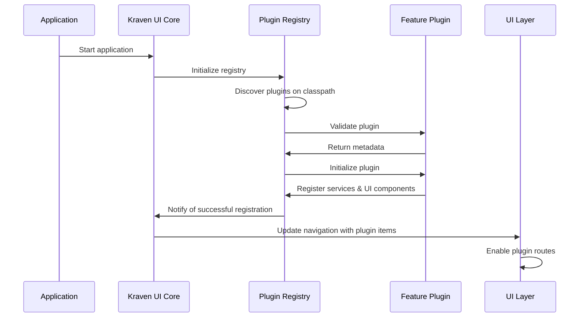

# Plugin-Based Feature Architecture for Kraven UI

## Overview

This document outlines the design for a plugin-based feature architecture for the Kraven UI library. This architecture will allow developers to create custom feature plugins that can be dynamically registered with the core library at runtime. Each plugin will be packaged independently and can be included in applications as needed, providing a flexible and extensible way to enhance the Kraven UI functionality.

## Goals

1. Enable third-party developers to create custom features for Kraven UI
2. Provide a clean, standardized way to register plugins with the core library
3. Allow dynamic discovery and registration of plugins at runtime
4. Support conditional UI rendering based on registered plugins
5. Maintain backward compatibility with existing features
6. Ensure plugins are isolated to prevent conflicts

## Architecture

### Core Components

1. **Plugin Registry**
   - Central registry for all plugins
   - Manages plugin lifecycle (registration, initialization, shutdown)
   - Provides API for querying available plugins

2. **Plugin Interface**
   - Standard contract that all plugins must implement
   - Defines lifecycle methods (initialize, start, stop)
   - Specifies metadata requirements (name, version, description)

3. **UI Integration Layer**
   - Dynamically builds UI navigation based on registered plugins
   - Provides extension points for plugins to inject UI components
   - Routes to plugin-specific pages

4. **Plugin Discovery Mechanism**
   - Auto-discovers plugins on the classpath
   - Supports manual registration for custom deployments
   - Validates plugin compatibility with core version

### Plugin Structure

Each plugin will consist of:

1. **Core Plugin Class**
   - Implements the Plugin interface
   - Provides metadata about the plugin
   - Handles initialization and shutdown logic

2. **Service Components**
   - Business logic specific to the plugin
   - Controllers for API endpoints
   - Service classes for functionality

3. **UI Metadata**
   - Navigation item details (name, icon, route)
   - UI component specifications
   - Localization resources

4. **Configuration**
   - Plugin-specific configuration properties
   - Default settings
   - Validation rules

### Registration Flow



## Plugin Development Workflow

1. **Create Plugin Project**
   - Set up Maven/Gradle project with appropriate dependencies
   - Implement the Plugin interface
   - Develop plugin-specific functionality

2. **Package Plugin**
   - Build JAR with all required dependencies
   - Include plugin descriptor for auto-discovery
   - Version according to semantic versioning

3. **Deploy Plugin**
   - Include plugin JAR in application classpath
   - Configure plugin through application properties
   - Restart application to activate plugin

## Plugin Manifest

Each plugin will include a manifest file (`kraven-plugin.json`) that provides metadata:

```json
{
  "pluginId": "io.github.rohitect.kraven.plugins.example",
  "name": "Example Plugin",
  "version": "1.0.0",
  "description": "An example plugin for Kraven UI",
  "provider": "Rohitect",
  "requires": {
    "kravenCore": ">=1.0.0",
    "java": ">=11"
  },
  "mainClass": "io.github.rohitect.kraven.plugins.example.ExamplePlugin",
  "ui": {
    "navigationItem": {
      "id": "example-plugin",
      "label": "Example Feature"
    }
  },
  "configuration": {
    "prefix": "kraven.plugins.example",
    "properties": [
      {
        "name": "enabled",
        "type": "boolean",
        "defaultValue": true,
        "description": "Enable or disable the example plugin"
      }
    ]
  }
}
```

## UI Integration

Plugins will be able to:

1. **Add Navigation Items**
   - Register entries in the header navigation with id and label
   - UI will automatically show/hide based on registered plugins

2. **Enable Routes**
   - The UI will enable routes based on registered plugin IDs
   - Plugin routes will be handled by a wildcard route pattern

3. **Future: Extend Existing Pages**
   - In future versions, plugins may add components to extension points on core pages
   - Contribute to dashboards and overview pages

## Security Considerations

1. **Plugin Validation**
   - Verify plugin signature before loading
   - Check compatibility with core version
   - Validate required dependencies

2. **Resource Isolation**
   - Limit plugin resource usage
   - Prevent plugins from interfering with each other
   - Sandbox plugin operations

3. **Permission Model**
   - Define what plugins can access
   - Allow administrators to control plugin capabilities
   - Audit plugin actions

## Configuration

Plugins will be configurable through application properties:

```yaml
kraven:
  plugins:
    # Global plugin settings
    enabled: true
    auto-discovery: true
    # Plugin-specific settings
    example:
      enabled: true
      custom-property: value
```

## Example Plugin Implementation

```java
@KravenPlugin(
    id = "io.github.rohitect.kraven.plugins.example",
    name = "Example Plugin",
    version = "1.0.0"
)
public class ExamplePlugin implements KravenUIPlugin {

    private final Logger log = LoggerFactory.getLogger(ExamplePlugin.class);

    @Override
    public void initialize(PluginContext context) {
        log.info("Initializing Example Plugin");
        // Register controllers, services, etc.
        context.registerController(new ExampleController());
        context.registerService(new ExampleService());

        // Register UI components
        context.registerNavigationItem(
            NavigationItem.builder()
                .id("example-plugin")
                .label("Example Feature")
                .build()
        );
    }

    @Override
    public void start() {
        log.info("Starting Example Plugin");
        // Start any background processes
    }

    @Override
    public void stop() {
        log.info("Stopping Example Plugin");
        // Clean up resources
    }
}
```

## Plugin Packaging

Plugins will be packaged as JAR files with the following structure:

```
example-plugin.jar
├── META-INF
│   ├── spring.factories
│   └── kraven-plugin.json
├── io
│   └── github
│       └── rohitect
│           └── kraven
│               └── plugins
│                   └── example
│                       ├── ExamplePlugin.class
│                       ├── controller
│                       │   └── ExampleController.class
│                       └── service
│                           └── ExampleService.class
└── static
    └── plugins
        └── example
            ├── components
            │   └── example.component.js
            └── assets
                └── example-icon.svg
```

## Maven Configuration

Plugin projects will use the following Maven configuration:

```xml
<project>
    <groupId>io.github.rohitect.kraven.plugins</groupId>
    <artifactId>example-plugin</artifactId>
    <version>1.0.0</version>

    <dependencies>
        <dependency>
            <groupId>io.github.rohitect</groupId>
            <artifactId>kraven-ui-plugin-api</artifactId>
            <version>1.0.0</version>
            <scope>provided</scope>
        </dependency>
    </dependencies>

    <build>
        <plugins>
            <plugin>
                <groupId>org.apache.maven.plugins</groupId>
                <artifactId>maven-assembly-plugin</artifactId>
                <configuration>
                    <descriptorRefs>
                        <descriptorRef>jar-with-dependencies</descriptorRef>
                    </descriptorRefs>
                </configuration>
                <executions>
                    <execution>
                        <phase>package</phase>
                        <goals>
                            <goal>single</goal>
                        </goals>
                    </execution>
                </executions>
            </plugin>
        </plugins>
    </build>
</project>
```

## Plugin Discovery

Plugins will be discovered through:

1. **Classpath Scanning**
   - Scan for classes annotated with `@KravenPlugin`
   - Look for plugin descriptor files in META-INF

2. **Spring Auto-configuration**
   - Use Spring's auto-configuration mechanism
   - Register plugins as Spring beans

3. **Manual Registration**
   - Provide API for programmatic registration
   - Support for custom plugin loaders

## Compatibility and Versioning

1. **Semantic Versioning**
   - Follow semantic versioning for plugins
   - Specify compatible core versions

2. **API Stability**
   - Maintain stable plugin API
   - Provide migration paths for breaking changes

3. **Feature Detection**
   - Allow plugins to detect available core features
   - Gracefully handle missing dependencies

## Implementation Phases

### Phase 1: Core Plugin Infrastructure

1. Define plugin interface and registry
2. Implement plugin discovery mechanism
3. Create plugin context for registration
4. Set up plugin lifecycle management

### Phase 2: UI Integration

1. Implement dynamic navigation building in the header
2. Add support for showing/hiding navigation items based on registered plugins
3. Implement wildcard routes for plugin pages
4. Build plugin settings UI

### Phase 3: Plugin Development Kit

1. Create plugin archetype for Maven
2. Develop plugin testing utilities
3. Write comprehensive documentation
4. Build example plugins

### Phase 4: Advanced Features

1. Add plugin marketplace concept
2. Implement plugin versioning and updates
3. Develop plugin dependency management
4. Create plugin health monitoring

## Conclusion

The plugin-based architecture will transform Kraven UI into a highly extensible platform where developers can easily add custom features. This approach will foster a community of plugin developers, expanding the capabilities of Kraven UI beyond its core functionality while maintaining a clean, modular codebase.

By providing a standardized way to develop, package, and deploy plugins, we enable a rich ecosystem of extensions that can be mixed and matched according to specific application needs, without requiring modifications to the core library.
