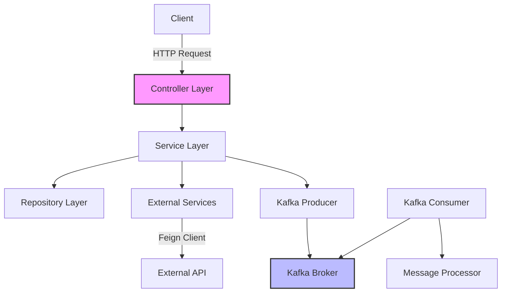
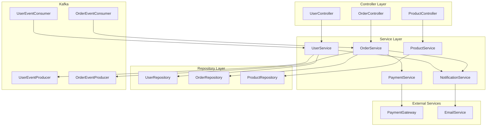
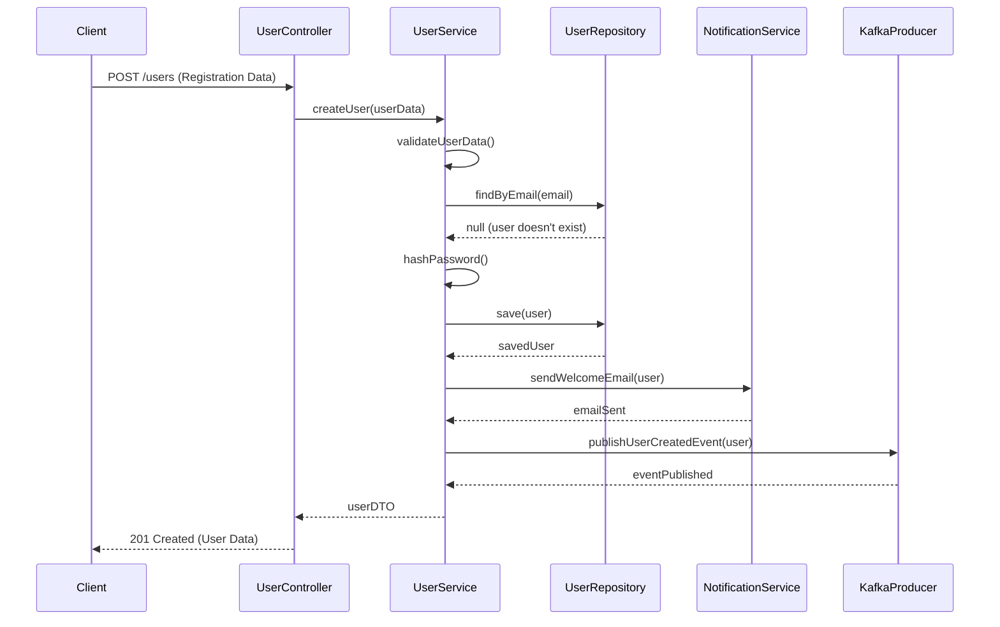

# Architecture

This section provides detailed information about the architecture of the Kraven Example service.

## System Architecture

The Kraven Example service follows a layered architecture pattern:



## Component Diagram

Here's a more detailed component diagram:



## Data Flow

Here's an example of the data flow for the order processing:

```businessflow OrderProcessingDetailed "Detailed Order Processing Flow"
- io.github.rohitect.example.controller.OrderController.createOrder: Receives order creation request with product IDs and quantities
- io.github.rohitect.example.service.OrderService.validateOrder: Validates order details and customer information
- io.github.rohitect.example.service.ProductService.getProductDetails: Retrieves product details for the order
- io.github.rohitect.example.service.InventoryService.checkAvailability: Checks if products are in stock
- io.github.rohitect.example.service.PricingService.calculateTotal: Calculates order total with discounts
- io.github.rohitect.example.service.PaymentService.processPayment: Processes payment through payment gateway
- io.github.rohitect.example.service.OrderService.createOrderRecord: Creates order record with line items
- io.github.rohitect.example.repository.OrderRepository.save: Persists order to database
- io.github.rohitect.example.service.InventoryService.updateInventory: Updates inventory levels
- io.github.rohitect.example.service.NotificationService.sendOrderConfirmation: Sends order confirmation to customer
- io.github.rohitect.example.kafka.OrderEventProducer.publishOrderCreatedEvent: Publishes order created event for downstream processing
```

## Sequence Diagram

Here's a sequence diagram for the user registration process:


