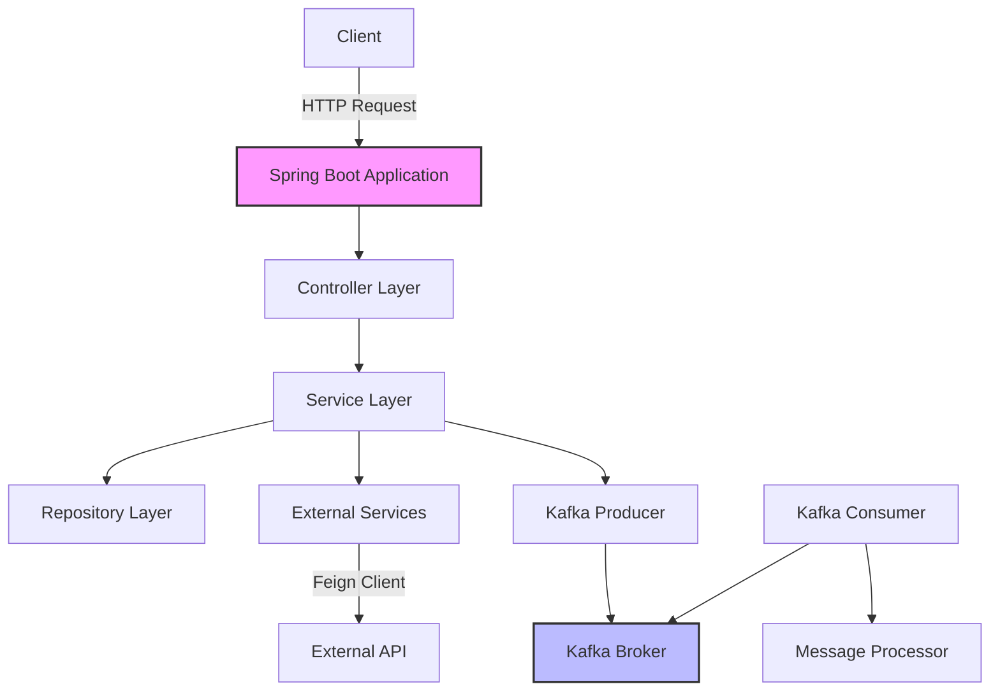

# Kraven Example Service

Welcome to the documentation for the Kraven Example service. This documentation is generated using Kraven's documentation feature.

## Introduction

Kraven is a powerful library for Spring Boot applications that provides a rich set of features for developers, including:

- API documentation and playground
- Feign client explorer
- Kafka management
- Business flow visualization
- Documentation with Mermaid diagrams


## Getting Started

To get started with Kraven, add the following dependency to your `pom.xml`:

```xml
<dependency>
    <groupId>io.github.rohitect</groupId>
    <artifactId>kraven-ui-spring-boot-starter</artifactId>
    <version>1.0.0</version>
</dependency>
```

Then, configure Kraven in your `application.yml`:

```yaml
kraven:
  ui:
    path: /kraven
    title: My Service
    description: My awesome service
  documentation:
    enabled: true
    path: classpath:kraven-docs/
```

## Architecture Overview

Here's a high-level overview of the Kraven Example service architecture:



## Business Flow Example

Here's an example of a business flow in our application:

```businessflow UserRegistration "User Registration Flow"
- io.github.rohitect.example.controller.UserController.registerUser: Receives user registration request
- io.github.rohitect.example.service.UserService.createUser: Validates and creates user
- io.github.rohitect.example.repository.UserRepository.save: Persists user to database
- io.github.rohitect.example.service.NotificationService.sendWelcomeEmail: Sends welcome email
- io.github.rohitect.example.kafka.UserEventProducer.publishUserCreatedEvent: Publishes user created event
```

Click on the "View Flow" button to see the detailed flow visualization.

## Next Steps

Explore the other sections of this documentation to learn more about the Kraven Example service:

- [Features](features/index.md): Detailed information about the features of the service
- [Architecture](architecture/index.md): Detailed architecture documentation
- [Guides](guides/index.md): How-to guides for common tasks
