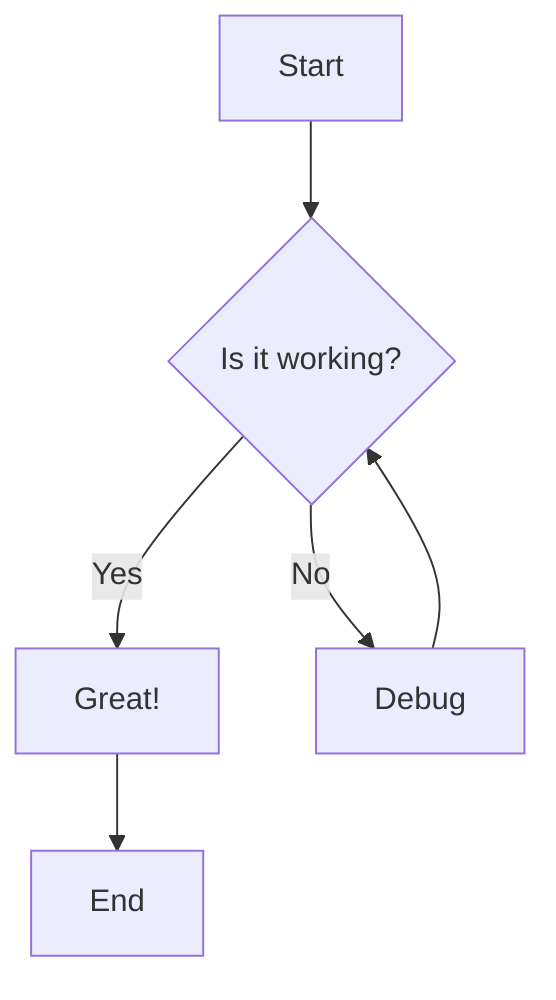
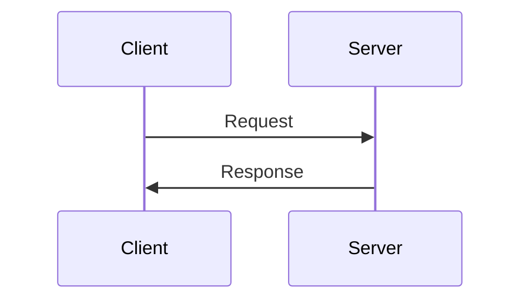
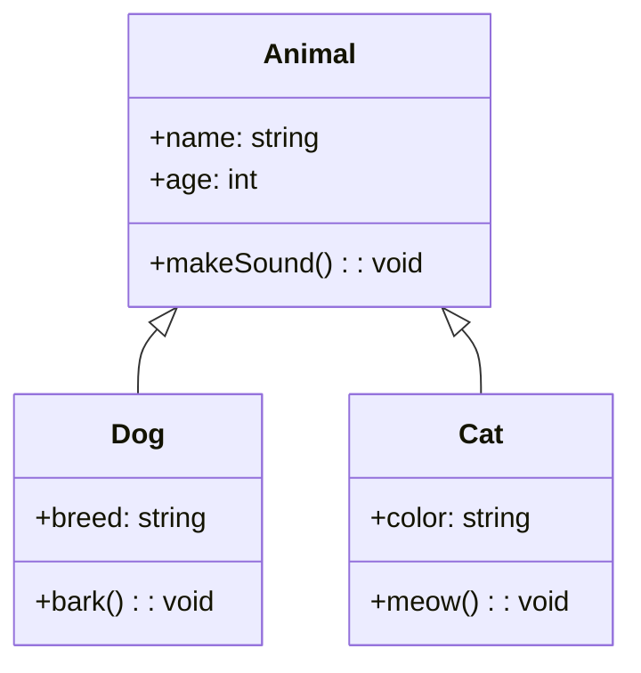
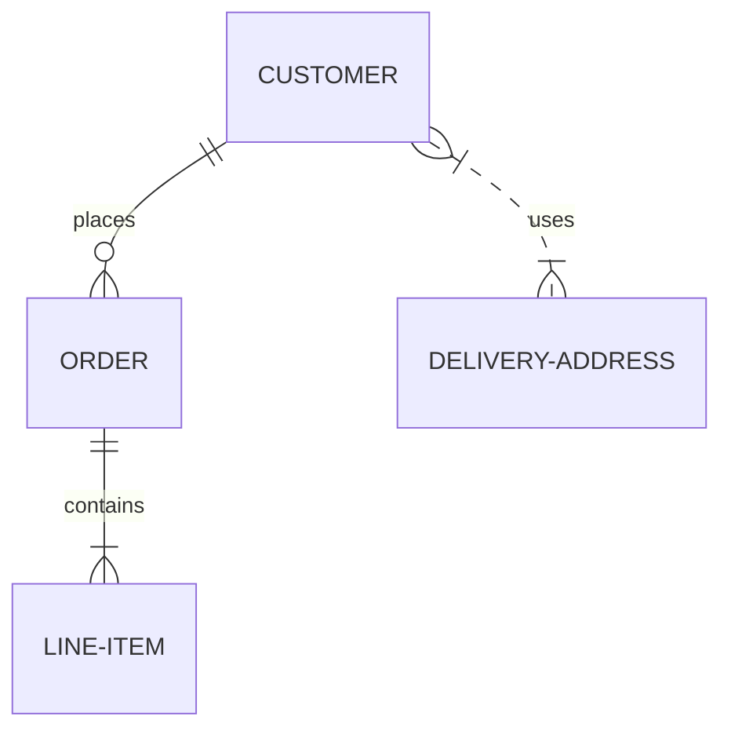
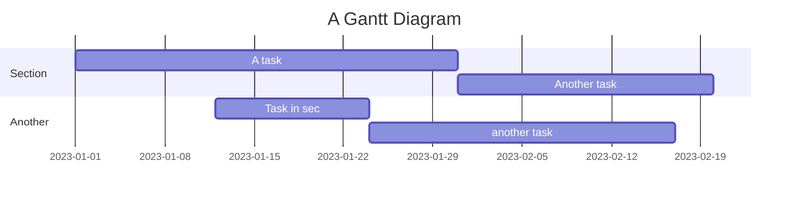

# Mermaid Test

This is a test of mermaid diagrams in markdown.

## Flowchart Example

```mermaid
flowchart TD
    A[Start] --> B{Is it working?}
    B -->|Yes| C[Great!]
    B -->|No| D[Debug]
    D --> B
    C --> E[End]
```

## Sequence Diagram Example

```mermaid
sequenceDiagram
    participant Client
    participant Server
    Client->>Server: Request
    Server->>Client: Response
```

## Class Diagram Example

```mermaid
classDiagram
    class Animal {
        +name: string
        +age: int
        +makeSound(): void
    }
    class Dog {
        +breed: string
        +bark(): void
    }
    class Cat {
        +color: string
        +meow(): void
    }
    Animal <|-- Dog
    Animal <|-- Cat
```

## Entity Relationship Diagram

```mermaid
erDiagram
    CUSTOMER ||--o{ ORDER : places
    ORDER ||--|{ LINE-ITEM : contains
    CUSTOMER }|..|{ DELIVERY-ADDRESS : uses
```

## Gantt Chart

```mermaid
gantt
    title A Gantt Diagram
    dateFormat  YYYY-MM-DD
    section Section
    A task           :a1, 2023-01-01, 30d
    Another task     :after a1, 20d
    section Another
    Task in sec      :2023-01-12, 12d
    another task     :24d
```
